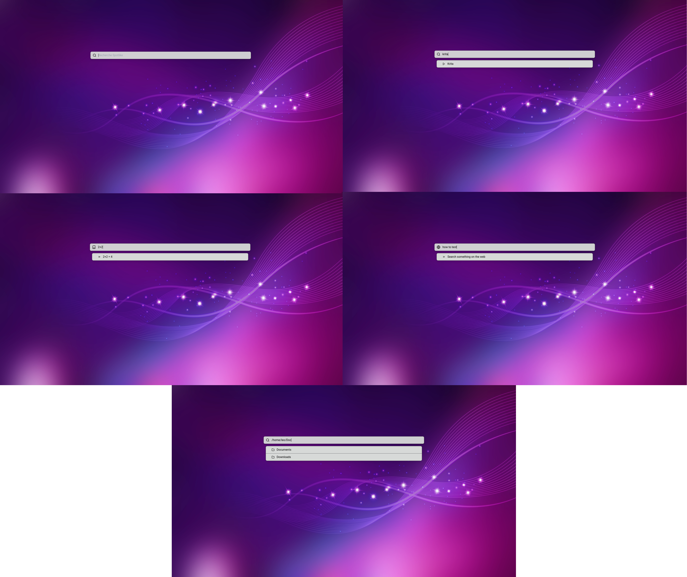

# Spotlike

Spotlight like made with electron

## Project Setup

### Install

```bash
$ npm install
```

### Development

```bash
$ npm run dev
```

### Build

```bash
# For windows
$ npm run build:win

# For macOS
$ npm run build:mac

# For Linux
$ npm run build:linux
```

### Installation

Build the applications then install from the file in the dist folder

#### Example Linux

```bash
sudo apt install ./dist/spotlike_0.0.1_amd64.deb
```

Once the installation complete you can assign the spotlike command that starts up the program to your desired shortcut

### Fonctionnality

- Start application
- Calculation
- Browse files
- Search on the web

### Screenshot


